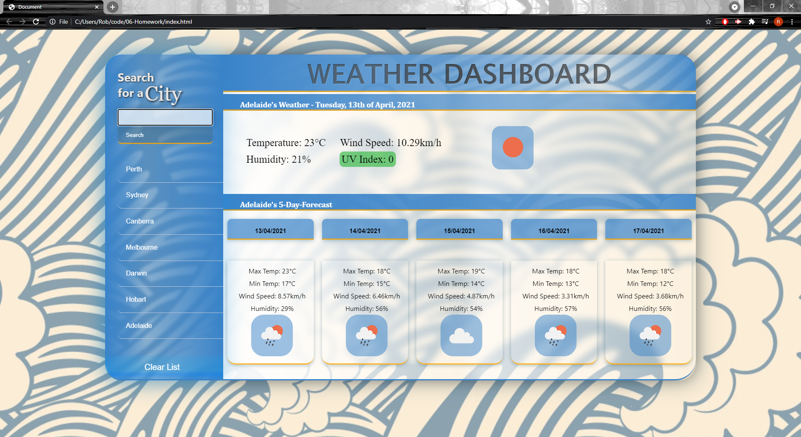

# 06 Server-Side APIs

## Weather Dashboard

This task felt a bit easier to complete than previous assignments and this allowed me to enjoy stylizing and adding some extra functionality. I feel I have improved slightly with my javascript-thinking and ability to solve problems with a little more ease. The initial stages were still a little daunting, figuring out how the Open Weather API works and how to call it, but once I got going it was quite easy to use. 

At the beginning I had a little trouble realizing how to know the latitude/longitute of every city, so I started by getting the information to show for just Perth's lat and lon typed into the URL. Once I got all information to display properly for Perth I then tried to figure out how to get the lat/lon. I then came across the API call with the city name, this then became easy to substitute the searchInput value into the URL and worked for every city. This was working fine until I reaslized that the UV Index properties were not available in this API call. It then fell into place that the lat/lon were available information in this URL and so I could then use this information to substitute into the original API call. 

I then added things like having the search history buttons first letter being a capital regardless of what the userInput is. I then added a clear button to get rid of previous search histories (although couldn't figure out how to remove singular localStorage keys as localStorage.clear() would remove ALL local storage), and also couldn't figure out how to remove ALL buttons at once. I had the searchInput area clear after each input even if the search was incorrect. This was to stop duplicates of buttons being created (duplicates can still be created but hopefully less likely).

I am quite happy with my effort, however I wish I had figured out how to solve those last few issues to make the whole experience a little more polished and clean. I feel that the presentation of the dashboard is quite nice, however the text and information shown looks a bit bland and unprofessional. 

Here is the link to my deployed application: https://robert-rousset.github.io/Weather-Dashboard/

And a screenshot 
